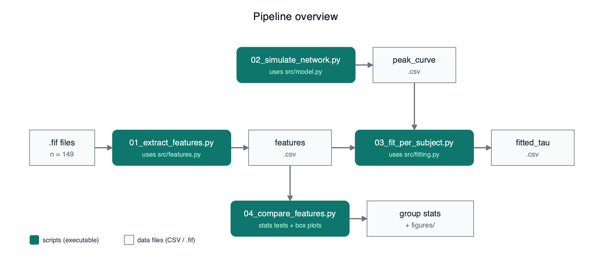

# 2026 CompuWorkshop: PD EEG Modeling

Workshop on Computational Neurology, SoSe 2026.
Team project: modelling cortical EEG slowing in Parkinson's disease.

> New here or got lost? See [`docs/plain_explanation.md`](docs/plain_explanation.md) for a plain-language walkthrough of the whole project.

## Team

| Name | Role |
|------|------|
| TBD  | data preprocessing and feature extraction |
| TBD  | Wilson-Cowan network implementation |
| TBD  | per-subject parameter fitting |
| TBD  | coordination, slides, write-up |

## Hypothesis

Compared to age-matched healthy controls, Parkinson's disease patients at rest show:
- decreased alpha (8-13 Hz) power
- increased theta (4-8 Hz) power
- decreased cortical beta (13-30 Hz) power

These three observations together describe a general "EEG slowing" pattern.

## Model

Wilson-Cowan, N nodes (number to be decided), all-to-all coupling (initial choice, may be revised).
Free parameter: inhibitory time constant tau_I.

## Setup

1. Clone this repo.
2. Create a Python environment (conda or venv) and install dependencies:
   `pip install -r requirements.txt`
3. Place the workshop EEG data folder somewhere on your machine.
4. Copy `.env.example` to `.env` and set the local path:
   `PD_DATA_DIR=/path/to/your/PD`
5. Run the pipeline scripts in order:
   `python scripts/01_extract_features.py`
   `python scripts/02_simulate_network.py`
   `python scripts/03_fit_per_subject.py`

## Pipeline overview



Three branches share the same `features.csv` extracted from raw EEG:

```
                       02_simulate_network.py
                       (uses src/model.py)
                                |
                                v
                          peak_curve.csv
                                |
                                v
.fif --> 01_extract_features.py --> features.csv --> 03_fit_per_subject.py --> fitted_tau.csv
         (uses src/features.py)            |          (uses src/fitting.py)
                                           |
                                           v
                                  04_compare_features.py
                                  (stats + box plots)
                                           |
                                           v
                                  group stats + figures/
```

- `01_extract_features.py` reads the raw `.fif` files and writes `results/features.csv` (per-subject alpha peak frequency + relative band powers).
- `02_simulate_network.py` runs the Wilson-Cowan network across a grid of tau_I values, writes `results/peak_curve.csv` (tau_I to simulated peak frequency lookup).
- `03_fit_per_subject.py` joins `features.csv` and `peak_curve.csv` to assign each subject a personal tau_I, writes `results/fitted_tau.csv`.
- `04_compare_features.py` runs group statistics on `features.csv` (data-level hypothesis test, independent of model).

## Folders

Each folder has its own README explaining what goes in it.

- `src/`: reusable functions, imported by scripts and notebooks
- `scripts/`: end-to-end pipeline scripts, numbered in order
- `notebooks/`: exploratory and interactive analysis
- `slides/`: Marp markdown for class presentations
- `docs/`: meeting notes and design decisions (including `docs/figures/pipeline.svg|png`)
- `results/`: generated outputs (features, figures, fitted parameters)

## Workflow

- `main` branch is always kept in a runnable state
- For any change, open a feature branch: `git checkout -b feature-name`
- Push your branch and open a Pull Request
- At least one teammate reviews and approves before merging into `main`
