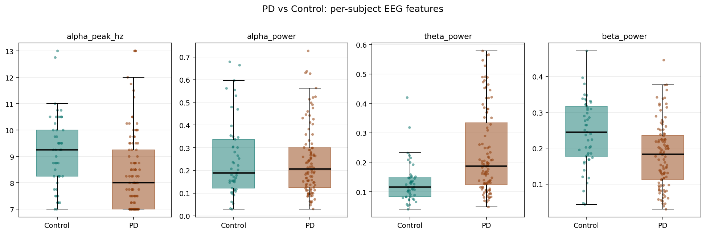
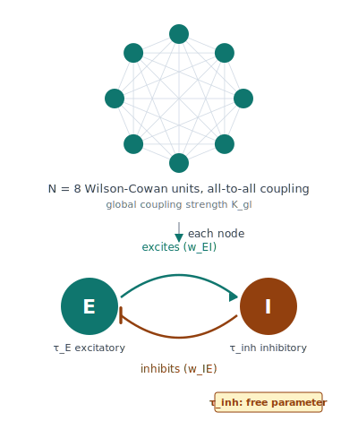
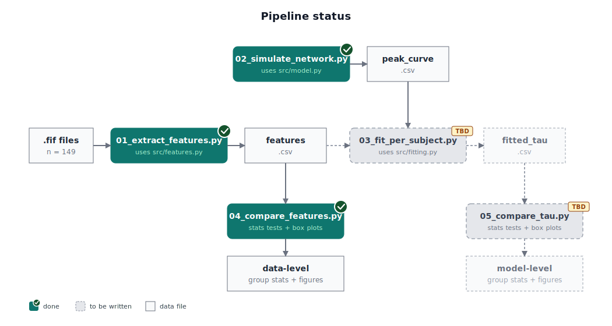
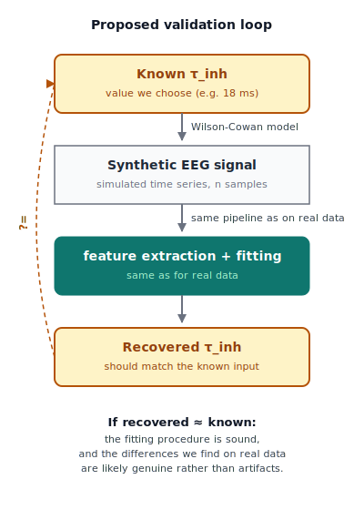

<!-- _class: title -->
<!-- _paginate: false -->

# Cortical EEG slowing in resting-state Parkinson's disease

Progress update: hypothesis, model, and next steps

PD EEG group · 22.05.2026

---

# Hypothesis (refined)

## What we predict

> Compared to age-matched healthy controls, Parkinson's disease patients at rest show:
> - **slowing of the alpha peak frequency** (8–13 Hz)
> - **increased theta-band power** (4–8 Hz)
> - **decreased cortical beta-band power** (13–30 Hz)

## Refinement based on data

Originally formulated as *"decreased alpha power"*. Group comparison on 149 subjects showed that **alpha relative power is essentially unchanged** between groups, while the **alpha peak frequency drops by ~1 Hz in PD** (median 9.25 → 8.00 Hz, p < 0.001).
The wording was refined to *"alpha peak slowing"* to reflect the actual change in the data.

<!-- _footer: PD vs Control box plots on per-subject features (n = 49 Control, 100 PD). Mann-Whitney U test, two-sided. -->

---

# Model: Wilson-Cowan network

## Why Wilson-Cowan

- **Biologically interpretable**: each node is an excitatory-inhibitory neural population pair.
- **One parameter for the change we model**: `τ_inh` sets the oscillation speed, which aligns with the alpha slowing in our hypothesis.

## Configuration

- **N = 8 nodes**, all-to-all coupling with global strength `K_gl`
- All nodes share a single global `τ_inh` (matches the whole-cortex slowing in our hypothesis)
- Deterministic limit-cycle regime (no noise) so the simulated peak frequency depends only on `τ_inh`
- Network output: one alpha peak whose frequency is set by `τ_inh`

---

# Status and next steps

## Done

- **Feature extraction** on 149 participants
- **Group comparison** on features: all 3 predicted directions significant (p < 0.001)
- **Wilson-Cowan network** built and validated (single-node and N=8)
- **`τ_inh` sweep**: lookup table built (11 → 32 ms)

## Remaining

- **Per-subject fitting** via curve inversion
- **Model-level group test** on fitted `τ_inh`
- State the final "+`Δτ_inh`" result

<!-- _footer: See docs/plain_explanation.md for per-step description. -->

---

# Current challenge

## Validation gap: the fitting has not been sanity-checked

Our per-subject fitting procedure inverts the `τ_inh` → peak frequency lookup curve to assign each participant a personal `τ_inh`. We have not yet verified that this procedure correctly recovers the parameter on a known case.

## What is missing

The proposed validation loop (right) closes this gap:

1. Pick a known `τ_inh`, generate synthetic EEG from the Wilson-Cowan model.
2. Run the same feature extraction and fitting pipeline on the synthetic signal.
3. Compare the recovered `τ_inh` to the value we put in.

Until this is done, we cannot fully tell whether differences in fitted `τ_inh` between PD and Control reflect a genuine effect or an artifact of the fitting procedure.

We would value input from the podium on how to design this in a way that is informative without growing the project beyond its current scope.

