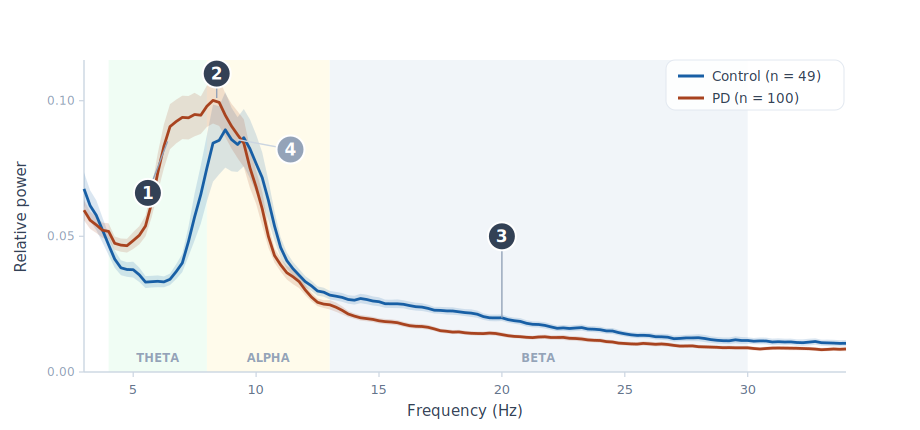
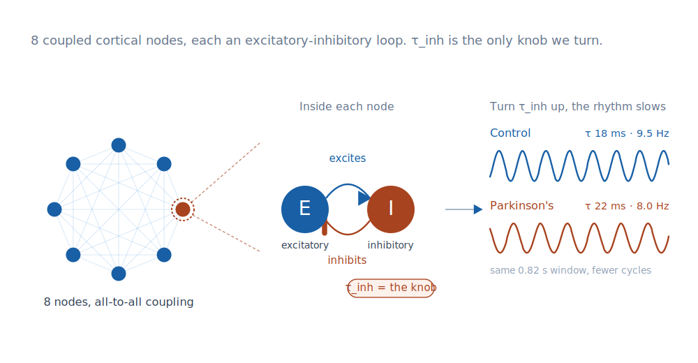
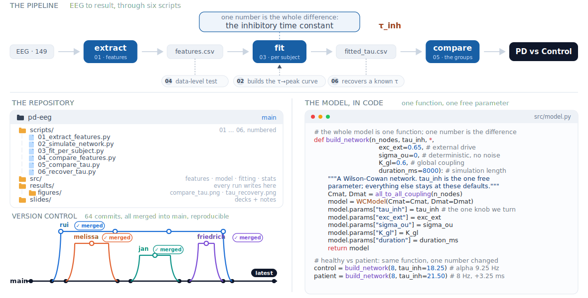
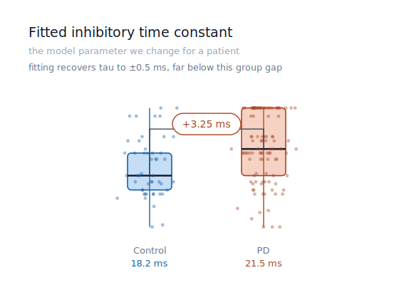
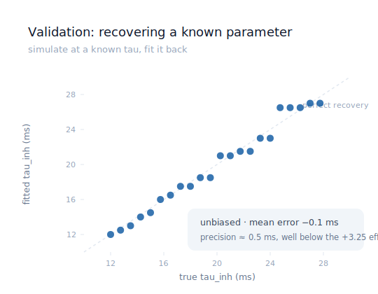
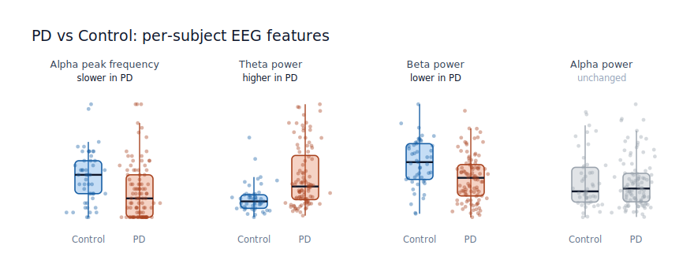
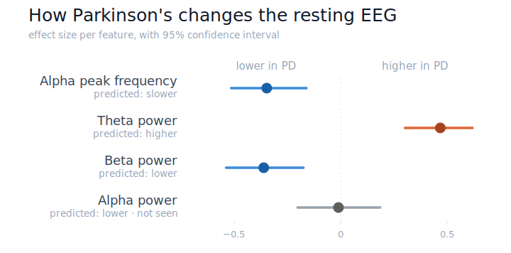

<!-- _class: title -->
<!-- _paginate: false -->

# Cortical EEG slowing in resting-state Parkinson's disease

Final presentation: model, code, and findings

PD EEG group · Rui, Jan, Melissa, Friedrich · 26.06.2026

<!--
This is our final presentation on cortical EEG slowing in resting-state Parkinson's disease. We will show our hypothesis, the model we built, how the code turns a healthy model into a patient model, the statistical result, where we would go next, and what each of us took from the course.
-->

---

# Hypotheses

Three resting-state EEG changes predicted in Parkinson's, all visible in the group-average spectrum:

Confirmed on 149 subjects: **alpha peak slows 9.25 → 8.00 Hz**, theta power up and beta power down (all p < 0.001); alpha power unchanged.

<!-- _footer: 49 Control, 100 PD · posterior channels · relative power ±SEM · Mann-Whitney U -->

<!--
Our three predictions from the literature, all in one figure: the average posterior power spectrum, controls in blue, patients in coral, with the standard error shaded. You can read the three changes straight off the curves. In the theta band, four to eight hertz, the patient curve sits above the control curve, so theta power is higher. Around the alpha peak the patient curve is shifted to the left, so the alpha rhythm slows. In the beta band, thirteen to thirty hertz, the control curve is above the patient curve, so beta power is lower. The line below gives the numbers: on 149 subjects the alpha peak drops from 9.25 to 8.00 hertz, theta up and beta down are both highly significant, and alpha power itself does not change, which is why we say alpha peak slowing rather than alpha loss.
-->

---

# The model: a Wilson-Cowan network

The final adaptation from healthy to patient is a single parameter: a longer inhibitory time constant **τ_inh**, about *+3.25 ms* in PD.

<!--
To explain this slowing we built a Wilson-Cowan network. On the left are eight cortical nodes, all connected to each other. Inside each node, in the middle, there is an excitatory population E and an inhibitory population I. E excites I, and I inhibits E, and that back-and-forth produces the rhythm. The one parameter we change is tau_inh, the inhibitory time constant, shown as the knob. On the right are two real outputs of this model. In blue, with a short tau_inh of about 18 milliseconds, the network oscillates at about 9 hertz, the control rhythm. In red, with a longer tau_inh of about 22 milliseconds, it oscillates at about 8 hertz. Same network, same time window, but the patient setting fits in fewer cycles. So the slowing in the data corresponds, in the model, to a longer inhibitory time constant, about three milliseconds longer in patients.
-->

---

# Code & repository

<!--
Across the top is the pipeline: the resting EEG of 149 people flows through six numbered scripts, from extracting the features, to fitting each person a model parameter from their alpha peak, to comparing the two groups. The three smaller scripts below build the lookup curve the fit uses, test the data directly, and validate the fit on synthetic data. The point to land is the highlighted box: the model is built once, and only one number turns a healthy model into a patient one, the inhibitory time constant tau_inh. On the lower left is the repository, organised into the numbered scripts, the reusable modules, and a results folder that every run writes into; below it a terminal makes the reproducibility concrete, since every number in this talk is the real output of running one script and each run writes the exact file you see. On the lower right is the version control: we developed on branches merged into main, fifty commits in total, and main reproduces every result and this deck.
-->

---

# Does the model separate patients from controls?

Fitted **τ_inh** is *+3.25 ms* higher in PD (one-sided Mann-Whitney, p ≈ 0.0002). The recovery test shows this is a real separation, not an artefact of the fitting.

<!--
Now we test the model the same way we tested the data. The left panel shows the fitted tau_inh for every subject, controls in blue, patients in red. The patient median is about three and a quarter milliseconds higher, and a one-sided Mann-Whitney test gives a p-value of about 0.0002, so the groups are clearly separated in the model parameter. The natural worry is that this is just an artefact of the fitting. The right panel rules that out. We simulated the model at known tau values and fitted them back. The points sit on the diagonal, the fit is unbiased, and its precision is about half a millisecond, far smaller than the three-millisecond group difference. So the separation is real, not a fitting artefact.
-->

---

# Outlook and open challenges

## Current challenges

- One parameter (τ_inh) reproduces the alpha slowing, but not the theta and beta changes
- The fit re-expresses the data-level effect, rather than adding independent evidence

## Future directions

- Fit more than the peak (full spectrum or functional connectivity), on a real connectome
- Relate fitted τ to clinical scores and to known inhibitory (GABAergic) changes in PD

<!-- (skeleton, for the teammate doing this slide to expand) Two parts, like a paper's discussion: our model's limitations, then future directions drawing on the wider literature. Starting points: limits -- one parameter only captures alpha, not theta/beta; the model-level test is not independent of the data result; simplified all-to-all noiseless network. Future -- fit richer targets (spectrum/FC) on a real connectome; link tau to clinical scores and GABAergic mechanisms. -->

---

# What we took away

**Rui** &nbsp; [your biggest learning]

**Jan** &nbsp; [your biggest learning]

**Melissa** &nbsp; [your biggest learning]

**Friedrich** &nbsp; [your biggest learning]

<!--
Each of us says our single biggest take-away from the course. [Each member states their own take-away in one sentence. Replace the placeholders on the slide before the talk.]
-->

---

<!-- _paginate: false -->

# Appendix: per-subject distributions

<!--
For reference, the full per-subject distributions behind the effect sizes. The box shows the median and quartiles, the dots are individual subjects. Alpha peak shifts down in patients, theta up, beta down, and alpha power is unchanged.
-->

---

<!-- _paginate: false -->

# Appendix: effect sizes

<!--
The same four features as standardised effect sizes: rank-biserial correlation with a 95 percent bootstrap confidence interval. Alpha peak, theta, and beta all sit well away from zero in the predicted direction; alpha power sits on zero.
-->
