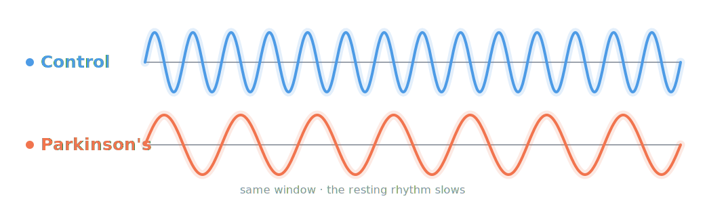
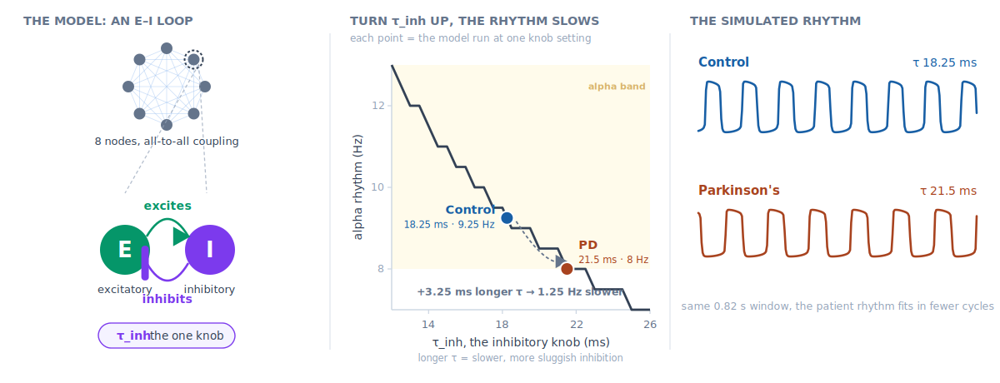
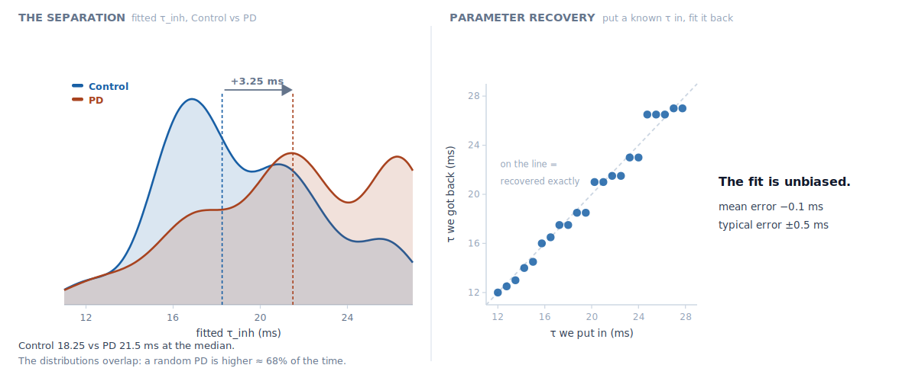
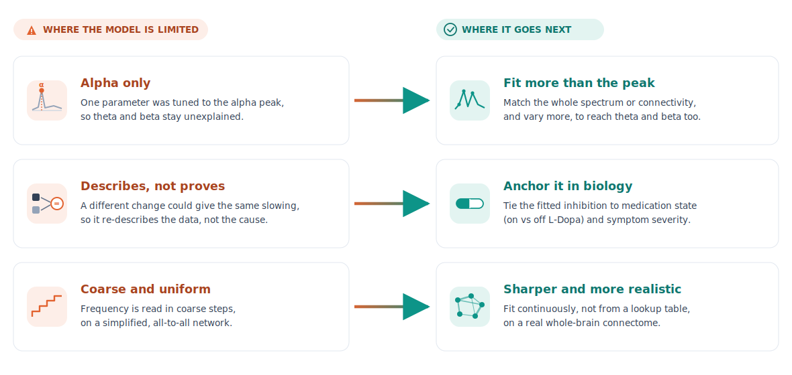

<!-- _class: title -->
<!-- _paginate: false -->

# Cortical EEG slowing in resting-state Parkinson's disease

Final presentation: model, code, and findings

PD EEG group · Rui, Jan, Melissa, Friedrich · 26.06.2026

<!--
- Final presentation: cortical EEG slowing in resting-state Parkinson's.
- Plan: hypothesis, the model, the code, the result, outlook, take-aways.
-->

---

<!-- _header: '
Hypotheses<i>·</i>Model<i>·</i>Code<i>·</i>Result<i>·</i>Outlook<i>·</i>Take-aways
' -->

# Hypotheses

Research question how does resting EEG change in Parkinson's, and can one mechanism explain the slowing?

**① theta power higher**
in PD &nbsp;·&nbsp; p < 0.001
confirmed

**② alpha peak slows**
9.25 → 8.00 Hz &nbsp;·&nbsp; p < 0.001
confirmed

**③ beta power lower**
in PD &nbsp;·&nbsp; p < 0.001
confirmed

**④ alpha power**
unchanged &nbsp;·&nbsp; p = 0.9
null

<!-- _footer: 49 Control, 100 PD · posterior channels · relative power ±SEM · Mann-Whitney U · the three effects hold under Bonferroni (4 tests) -->

<!--
- Research question (top line): how does resting EEG change in Parkinson's, and can one mechanism explain the slowing? The four predictions answer the first half; the model answers the second.
- One figure: average posterior power spectrum, Control (blue) vs PD (coral), ±SEM.
- Read the three predicted changes straight off the curves:
  - theta (4 to 8 Hz): PD above Control, so theta power is higher.
  - alpha peak: PD shifted left, so the rhythm slows.
  - beta (13 to 30 Hz): Control above PD, so beta power is lower.
- Numbers, 149 subjects: alpha peak 9.25 to 8.00 Hz; theta up and beta down both highly significant.
- Fourth prediction, greyed out: alpha power is a null, it does not change.
- The point: the change is in frequency, not amplitude, so we say alpha slowing, not alpha loss. That frequency change is what the model reproduces next, which is why the model focuses on the alpha slowing (theta and beta are amplitude changes, picked up in the outlook).
- If asked about multiple comparisons: we ran four tests, and the three significant effects all sit at p < 0.001, well under the Bonferroni threshold of 0.05 over four, which is 0.0125, so they survive correction; the fourth is a genuine null.
-->

---

<!-- _header: '
Hypotheses<i>·</i>Model<i>·</i>Code<i>·</i>Result<i>·</i>Outlook<i>·</i>Take-aways
' -->

# The model: a Wilson-Cowan network

Why Wilson-Cowan the rhythm comes out of the excitatory-inhibitory mechanism, so the slowing has a real cause we can name (slower inhibition), not just a frequency we dial down by hand. That cause is the one knob our hypothesis points to.

One knob only every other setting is held fixed, so the whole change from healthy to patient is a single number, a longer inhibitory time constant **τ_inh** (about *+3.25 ms* in PD).

<!--
- A Wilson-Cowan network explains the slowing.
- WHY WILSON-COWAN (emphasise this one, model choice is one of the evaluation criteria): a Wilson-Cowan loop has a real biological mechanism, so the alpha slowing maps onto one interpretable cause, a slower inhibitory time constant tau_inh. A generic oscillator like the Hopf model would only let us turn the frequency down by hand, which renames the slowing without explaining it; here the rhythm speed genuinely comes out of how fast inhibition acts.
- One knob only: every other setting is held fixed at standard values (neurolib defaults, no noise, 8 nodes all-to-all, 8 s), and we vary only tau_inh, so any group difference comes from one number.
- Left, the mechanism: 8 coupled nodes; in each, E excites I and I inhibits E, and that loop produces the rhythm. The inhibition has a time constant, tau_inh, the one knob we turn.
- Middle, the dial: tau_inh sets the frequency; turn it up and the alpha peak drops down the curve.
  - Control about 18 ms to 9.25 Hz; PD about +3.25 ms longer to 8 Hz, the slowing we measured.
- Right, the rhythm: two real simulated waveforms; same window, PD fits in fewer cycles.
- Takeaway: the whole healthy-to-patient change is one number.
-->

---

<!-- _header: '
Hypotheses<i>·</i>Model<i>·</i>Code<i>·</i>Result<i>·</i>Outlook<i>·</i>Take-aways
' -->

# Code & repository

<!--
- Top, the pipeline: the EEG of 149 people flows through six numbered scripts: extract features, fit each person a tau from their alpha peak, compare the groups. (02 builds the lookup curve, 04 tests the data directly, 06 validates the fit.)
  - Key box: the model is built once; one number, tau_inh, turns healthy into patient.
- Lower-left top, the repository: numbered scripts, reusable modules, a results folder every run writes into.
  - Lower-left below it, version control: feature branches reviewed and merged into main, sixty-four commits; main reproduces every result and this deck.
- Lower-right, the actual code. Say roughly: "This is the real code, and you do not need to read it, the shape is the point. The whole model is this one short function. It has a handful of settings, and we keep every one of them at a standard value, the same for everybody. There is only one thing we ever change: this highlighted line, a single number called tau_inh that sets how fast the brain rhythm is. So a healthy brain and a Parkinson's brain run the exact same code, with exactly one number different. At the bottom you can see it: the same function, 18.25 for a healthy control and 21.50 for a patient. That one small change is our whole model of the disease."
-->

---

<!-- _header: '
Hypotheses<i>·</i>Model<i>·</i>Code<i>·</i>Result<i>·</i>Outlook<i>·</i>Take-aways
' -->

# Does the model separate patients from controls?

Fitted **τ_inh** re-expresses the measured slowing as a model parameter (one-sided Mann-Whitney p ≈ 0.0002).

<!--
- The model-level result, told honestly.
- Left, the separation: fitted tau_inh per subject. Medians +3.25 ms apart (Control 18.25, PD 21.5), highly significant. But the distributions overlap, so this separates the groups on average, not individual patients. It re-expresses the measured alpha slowing in model units.
- Right, parameter recovery: put a known tau in, fit it back; the points land on the diagonal, so the fit is unbiased, typical error about half a millisecond.
- What the model adds: not new statistical evidence, but the mechanistic reading plus this validated, unbiased fit.
- If asked why the test is one-sided: the hypothesis is directional, we predicted in advance that PD would have the longer, slower tau, so a one-sided Mann-Whitney is the appropriate test.
-->

---

<!-- _header: '
Hypotheses<i>·</i>Model<i>·</i>Code<i>·</i>Result<i>·</i>Outlook<i>·</i>Take-aways
' -->

# Outlook and open challenges

<!--
- Two parts: where the model is limited (left, coral) and where it would go next (right, blue); each arrow pairs a limit with the next step that addresses it.
- Limit 1, alpha only: we tuned one parameter to the alpha peak, so theta and beta are unexplained. Next: fit the whole spectrum or the connectivity and vary more of the model, so theta and beta come into reach.
- Limit 2, describes not proves: a different change could give the same slowing (this is degeneracy), so the fit re-describes the data, it does not prove the cause is slower inhibition. Next: anchor it in biology, link the fitted inhibition to medication state (on vs off L-Dopa) and symptom severity.
- Limit 3, coarse and uniform: frequency is read in coarse steps (about half a ms), on a simplified all-to-all network. Next: fit continuously instead of from a lookup table, on a real whole-brain connectome.
- LAND THIS (limitations and reflection is one of the evaluation criteria): so far this is an alpha-slowing model, not a full PD model; we know the gaps and each one has a concrete next step.
-->

---

<!-- _header: '
Hypotheses<i>·</i>Model<i>·</i>Code<i>·</i>Result<i>·</i>Outlook<i>·</i>Take-aways
' -->

# What we took away

**Rui**
Carrying this end to end, from raw EEG to the fitted model, taught me that a result is only as trustworthy as the pipeline behind it; the reproducible scripts and the honest recovery check mattered as much as the model.

**Melissa**
My biggest learning was how much easier good documentation makes everything, whether it's the repository structure, script naming, clear responsibilities, or the code itself. It keeps the whole team aligned, helps everyone track progress, and makes even complex or unfamiliar methods feel more approachable.

**Jan**
This course taught me that you do not have to be a master programmer to meaningfully contribute to, and clinically interpret, advanced computational research.

**Friedrich**
How big a difference good communication makes. Even missing one group meeting meant you basically missed all the progress. In-person communication is essential to work well together and establish a group-wide understanding.

---

<!-- _paginate: false -->

# Appendix and references

Data Anjum MF, et al. Resting-state EEG measures cognitive impairment in Parkinson's disease. npj Parkinson's Disease (2024). doi:10.1038/s41531-023-00602-0

Model Wilson HR, Cowan JD. Excitatory and inhibitory interactions in localized populations of model neurons. Biophysical Journal 12, 1-24 (1972).

Tool Cakan C, Jajcay N, Obermayer K. neurolib: a simulation framework for whole-brain neural mass modeling. Cognitive Computation (2023). doi:10.1007/s12559-021-09931-9

